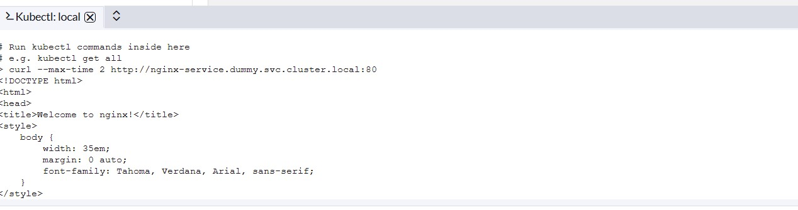
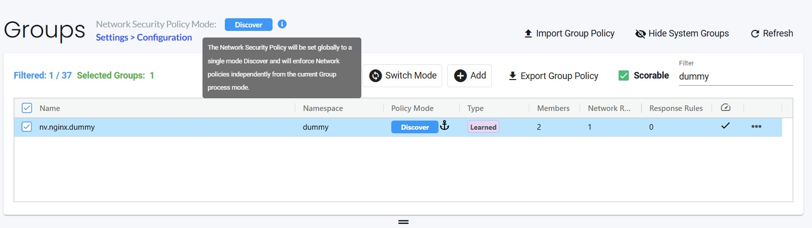
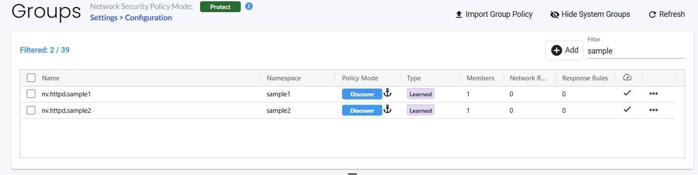
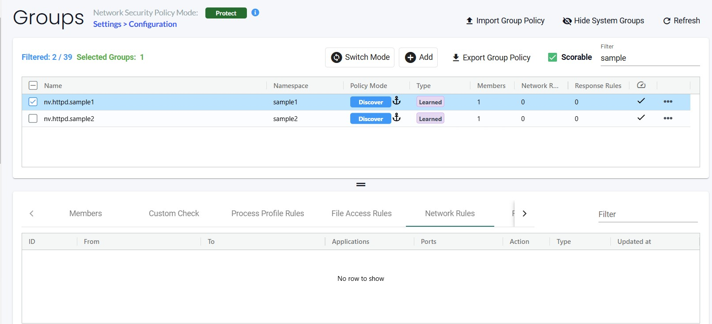

= Introduction to NeuVector Network rules

In this post we will examine using NeuVector Network rules we will try to understand its basics and usage.

.References :

:sectnums:

== What are Network rules
Networkrules are the NeuVector way of defining a declarative policy to govern allowed and denied application layer connections. Network rules specify ALLOWED or DENIED behavior for your applications. Think of it like a firewall for your CNI. 

=== But we have Network Policies why another thing? 

Blocking connections on a namespace basis is good but with NeuVector we can go further and manage connection rules on the cluster level with policies matching multiple namespaces and complex rules like virtualhost... creating zero-trust policies is easy with NV discover mode... 

==  Group discovery in NeuVector
To explain how NV discover containers lets try a simple sample

we will create a dummy namespace, with Ngnix deployment and see how NV discover it.

[source,yaml]
----
kind: Namespace
apiVersion: v1
metadata:
  name: dummy
spec:
  finalizers:
    - kubernetes
---
apiVersion: apps/v1
kind: Deployment
metadata:
  name: nginx
  namespace: dummy
  labels:
    app: nginx-deployment
spec:
  replicas: 2
  selector:
    matchLabels:
      app: nginx-deployment
  template:
    metadata:
      labels:
        app: nginx-deployment
    spec:
      containers:
      - name: nginx
        image: nginx:1.14.2
        ports:
        - containerPort: 80
----

NeuVector automatically creates Groups from your running applications. These groups start with the prefix 'nv.' 
so far NV discovered one group

* nv.<workload_name>.<namespace_name> -> nv.nginx.dummy: This group represents the kubernetes workload kind (deployment, sts,ds). In this case its deployment
+
image::img/network_discover_6.jpg[]

after this we will expose a service for the deployment 
[source,yaml]
----
apiVersion: v1
kind: Service
metadata:
  name: nginx-service
  namespace: dummy
spec:
  selector:
    app : nginx-deployment
  type: ClusterIP
  ports:
  - protocol: TCP
    port: 80
    targetPort: 80
----

Now lets connect to this service from any pod or from the node 
[source,bash]
----
curl --max-time 2 http://nginx-service.dummy.svc.cluster.local:80
----

Now if you check the discovered rules then you will find the new rule that generated based on this curl.

[NOTE]
one thing to note is that 
There is a global setting available in Settings -> Configuration to separately set the network protection 
mode for enforcement of network rules. Enabling this (default is disabled), 
causes all network rules to be in the protection mode selected (Discover, Monitor, Protect), 
while process/file rules remain in the protection mode for that Group, as displayed in the Policy -> Groups screen. 
In this way, network rules can be set to Protect (blocking), while process/file policy can be set to Monitor, or vice versa.

[[nv_groups]]
So the basic thing to understand now, is the meaning of groups start with the prefix 'nv.' as those groups will be used in the policy rules when we want to refer to ingress or egress rule selector if we want to refer to a specific container workload or service.

== Pod inter-communications

In the next section we will explain NV discovering for Pod inter-communication and examine how to define a network policy to protect and isolate a specific namespaces.
 
[source,yaml]
----
# create first sample application
kind: Namespace
apiVersion: v1
metadata:
  name: sample1
spec:
  finalizers:
    - kubernetes
---
apiVersion: apps/v1
kind: Deployment
metadata:
  name: httpd
  namespace: sample1
  labels:
    app: httpd
spec:
  replicas: 1
  selector:
    matchLabels:
      app: httpd
  template:
    metadata:
      labels:
        app: httpd
    spec:
      containers:
      - name: apache
        image: webratio/httpd-with-curl:2.4
        ports:
        - containerPort: 80
---
apiVersion: v1
kind: Service
metadata:
  name: httpd
  namespace: sample1
spec:
  selector:
    app: httpd
  type: ClusterIP
  ports:
  - protocol: TCP
    port: 80
    targetPort: 80
----

[source,yaml]
----
# create Second sample application
kind: Namespace
apiVersion: v1
metadata:
  name: sample2
spec:
  finalizers:
    - kubernetes
---
apiVersion: apps/v1
kind: Deployment
metadata:
  name: httpd
  namespace: sample2
  labels:
    app: httpd
spec:
  replicas: 1
  selector:
    matchLabels:
      app: httpd
  template:
    metadata:
      labels:
        app: httpd
    spec:
      containers:
      - name: apache
        image: webratio/httpd-with-curl
        ports:
        - containerPort: 80
---
apiVersion: v1
kind: Service
metadata:
  name: httpd
  namespace: sample2
spec:
  selector:
    app: httpd
  type: ClusterIP
  ports:
  - protocol: TCP
    port: 80
    targetPort: 80
----

lets see what NV discovered so far, I will focus on sample1

NeuVector automatically creates Groups from your running applications. These groups start with the prefix 'nv.' 
so far NV discovered two groups as explained before.

* nv.<workload_name>.<namespace_name> -> nv.httpd.sample1: This group represents the kubernetes workload kind (deployment, sts,ds). In this case its deployment
+
image::img/network_discover_2.jpg[]

As we didn't use much,so NV didn't discover much of network rules. 

So lets create some traffic and play with curl to create some communication

[source,bash]
----
# From sample1 call sample2
kubectl exec -n sample1 $(kubectl get po -n sample1 -l app=httpd -o name) -- curl --max-time 2 http://httpd.sample2.svc.cluster.local:80

# From sample2 call sample1
kubectl exec -n sample2 $(kubectl get po -n sample2 -l app=httpd -o name) -- curl --max-time 2 http://httpd.sample1.svc.cluster.local:80

----

so as you see NV start to discover some of network rules. 
image::img/network_discover_9.jpg[]

=== Configuring NeuVector Network rules

First thing is to ensure that NV Network Security Policy Mode is Protect so it blocks any communication unless there is an explicit Network rule to enable it. You can do this through across the whole cluster settings page.

image::img/network_protect.jpg[]

IMPORTANT: Once you enable Network Security Policy Mode as Protect, all cluster communication will be blocked unless explicitly enabled.  

or to specifically select your target groups  

image::img/network_protect_1.jpg[]
image::img/network_protect_2.jpg[]

*Now what we want to do*; we want to create a set of rules that are applied to all of our httpd containers, For this reason we will create a new custom group which selects all our httpd container. 

As we are testing so we will delete all Network rules discovered so far and create everything from scratch. After you delete the rules, don't forget to save.

image::img/network_rules_1.jpg[]

