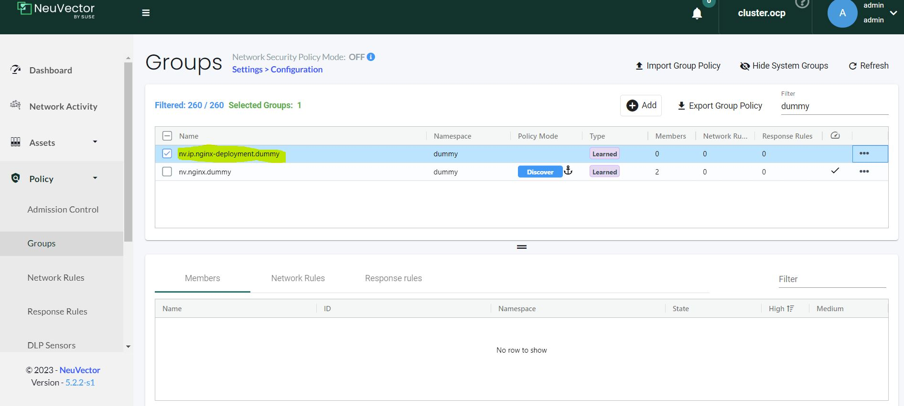
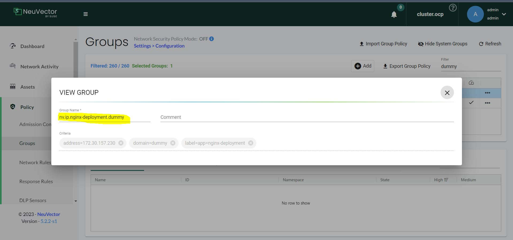
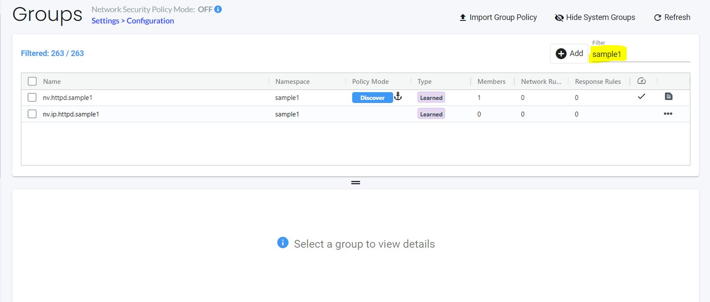
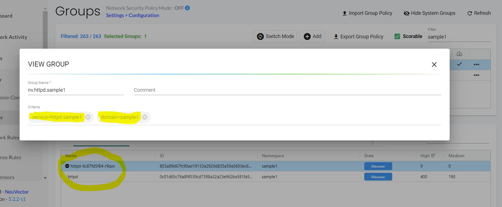
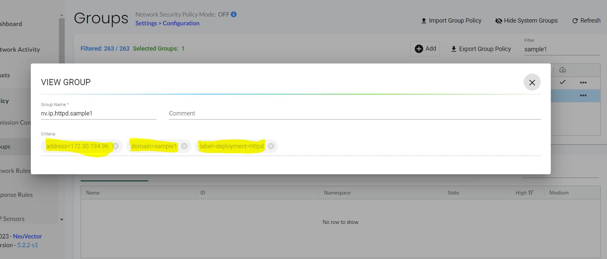
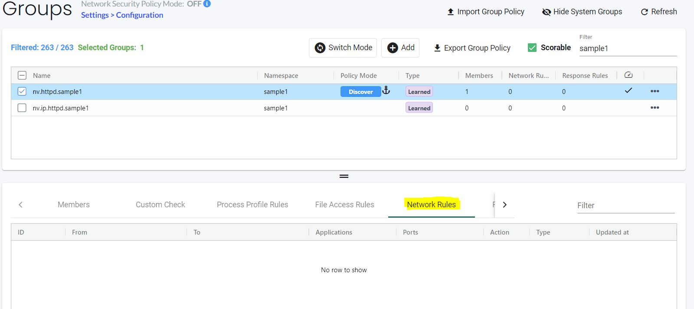
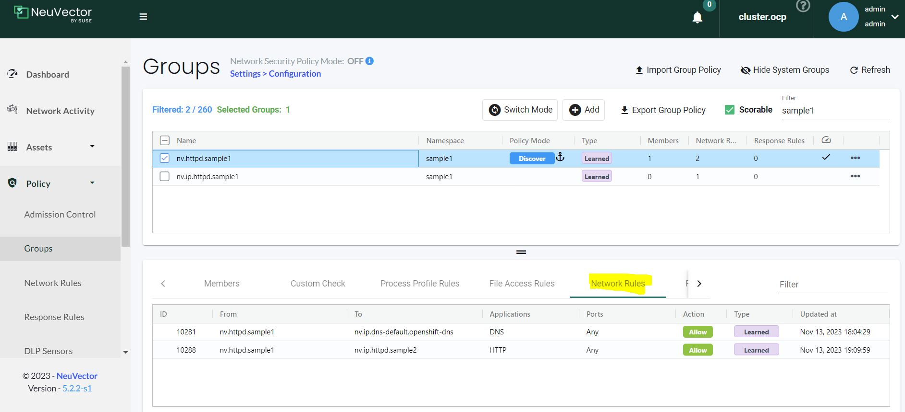
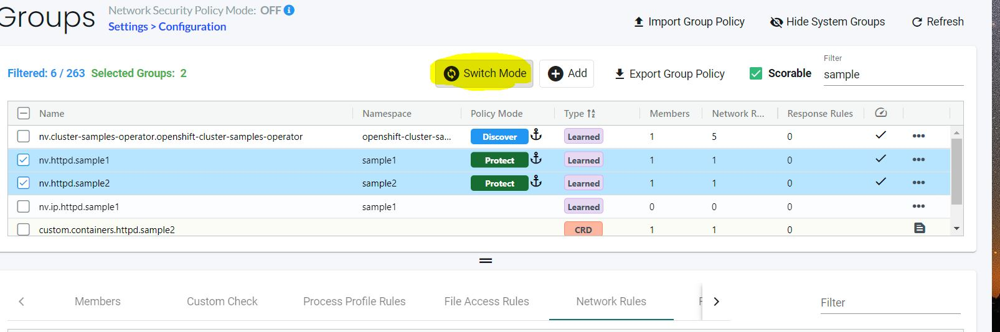
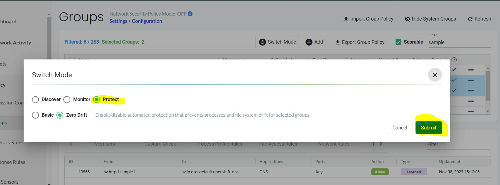
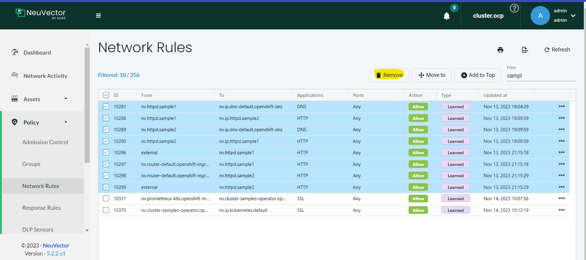

= Introduction to NeuVector Network rules

In this post we will examine using NeuVector Network rules we will try to understand its basics and usage.

.References :

:sectnums:

== What are Network rules
Networkrules are the NeuVector way of defining a declarative policy to govern allowed and denied application layer connections. Network rules specify ALLOWED or DENIED behavior for your applications. Think of it like a firewall for your CNI. 

=== But we have Network Policies why another thing? 

Blocking connections on a namespace basis is good but with NeuVector we can go further and manage connection rules on the cluster level with policies matching multiple namespaces and complex rules like virtualhost... creating zero-trust policies is easy with NV discover mode... 

==  Group discovery in NeuVector
To explain how NV discover containers lets try a simple sample

we will create a dummy namespace, with Ngnix deployment and see how NV discover it.

[source,yaml]
----
kind: Namespace
apiVersion: v1
metadata:
  name: dummy
spec:
  finalizers:
    - kubernetes
---
apiVersion: apps/v1
kind: Deployment
metadata:
  name: nginx
  namespace: dummy
  labels:
    app: nginx-deployment
spec:
  replicas: 2
  selector:
    matchLabels:
      app: nginx-deployment
  template:
    metadata:
      labels:
        app: nginx-deployment
    spec:
      containers:
      - name: nginx
        image: nginx:1.14.2
        ports:
        - containerPort: 80
---
kind: RoleBinding
apiVersion: rbac.authorization.k8s.io/v1
metadata:
  name: 'system:openshift:scc:anyuid'
  namespace: dummy
subjects:
  - kind: ServiceAccount
    name: default
    namespace: dummy
roleRef:
  apiGroup: rbac.authorization.k8s.io
  kind: ClusterRole
  name: 'system:openshift:scc:anyuid'
----

NeuVector automatically creates Groups from your running applications. These groups start with the prefix 'nv.' 
so far NV discovered one group

* nv.<workload_name>.<namespace_name> -> nv.nginx.dummy: This group represents the kubernetes workload kind (deployment, sts,ds). In this case its deployment
+
image::img/network_discover_6.jpg[]

after this we will expose a service for the deployment 
[source,bash]
----
oc expose deploy/nginx --name=nginx-deployment
----

NV discovered another group

* nv.ip.<service_name>.<namespace_name> -> nv.ip.nginx-deployment.dummy: This group represents kubernetes service.
+

+

As we didn't use much, our nginx server so NV didn't discover much of network rules.

[[nv_groups]]
But the basic thing to understand now, is the meaning of groups start with the prefix 'nv.' as those groups will be used in the policy rules when we want to refer to ingress or egress rule selector if we want to refer to a specific container workload or service.

== Pod inter-communications

In the next section we will explain NV discovering for Pod inter-communication and examine how to define a network policy to protect and isolate a specific namespaces.
 
[source,bash]
----
# create first sample application
oc new-project sample1
oc new-app httpd

# create Second sample application
oc new-project sample2
oc new-app httpd
----
lets see what NV discovered so far, I will focus on sample1

NeuVector automatically creates Groups from your running applications. These groups start with the prefix 'nv.' 
so far NV discovered two groups as explained before.

* nv.<workload_name>.<namespace_name> -> nv.httpd.sample1: This group represents the kubernetes workload kind (deployment, sts,ds). In this case its deployment
* nv.ip.<service_name>.<namespace_name> -> nv.ip.httpd.sample1: This group represents kubernetes service.
+

+

As we didn't use much,so NV didn't discover much of network rules. 

So lets create some traffic and play with curl to create some communication

[source,bash]
----
# From sample1 call sample2
oc exec -n sample1 $(oc get po -n sample1 -l deployment=httpd -o name) -- curl --max-time 2 http://httpd.sample2.svc.cluster.local:8080

# From sample2 call sample1
oc exec -n sample2 $(oc get po -n sample2 -l deployment=httpd -o name) -- curl --max-time 2 http://httpd.sample1.svc.cluster.local:8080

----

so as you see NV start to discover some of network rules. 

Then we will expose the apache HTTP server so it can be externally accessibility

[source,bash]
----
oc expose svc/httpd  -n sample1
oc expose svc/httpd  -n sample2

curl "http://$(oc get route -n sample1 -l  app.kubernetes.io/component=httpd  -o go-template='{{range .items}}{{.spec.host}}{{end}}')" 

curl "http://$(oc get route -n sample2 -l  app.kubernetes.io/component=httpd  -o go-template='{{range .items}}{{.spec.host}}{{end}}')" 

----
as you see NV discover more network rules, related to external and router communication. 

now we can also check the internals of NV to see how rule have been created 
[source,bash]
----
oc rsh -n neuvector $(oc get po -o name -l app=neuvector-manager-pod -n neuvector) cli
#neuvector-svc-controller.neuvector> login --username admin --password xxx
admin#neuvector-svc-controller.neuvector> show container -c httpd -b
+--------------+---------------------------------------------------------------------------------+---------------+----------+
| id           | name                                                                            | service       | state    |
+--------------+---------------------------------------------------------------------------------+---------------+----------+
| c54bb82092b9 | k8s_POD_httpd-74644dfcb7-262sj_sample1_3c50d754-9df8-4c94-a11f-a57d07d219c8_0   | httpd.sample1 | discover |
| 4fbe62c89743 | k8s_POD_httpd-74644dfcb7-d2cqd_sample2_2c44da32-d9db-435a-85f9-692edc22d73e_0   | httpd.sample2 | discover |
| 18b98d4e1a11 | k8s_httpd_httpd-74644dfcb7-262sj_sample1_3c50d754-9df8-4c94-a11f-a57d07d219c8_0 | httpd.sample1 | discover |
| b2da8b411ca0 | k8s_httpd_httpd-74644dfcb7-d2cqd_sample2_2c44da32-d9db-435a-85f9-692edc22d73e_0 | httpd.sample2 | discover |
+--------------+---------------------------------------------------------------------------------+---------------+----------+
admin#neuvector-svc-controller.neuvector> show policy derived -c c54bb82092b9
admin#neuvector-svc-controller.neuvector> show policy derived -c 18b98d4e1a11
Container: id=18b98d4e1a11 name=k8s_httpd_httpd-74644dfcb7-262sj_sample1_3c50d754-9df8-4c94-a11f-a57d07d219c8_0 rules=6
+-----------+-------------+----------------+------+-------------+-----------+---------+--------+
| policy_id | from        | to             | port | application | action    | ingress | domain |
+-----------+-------------+----------------+------+-------------+-----------+---------+--------+
|     10281 | 10.128.8.46 | 172.30.0.10    | any  |             | check_app | False   |        |
|     10281 | 10.128.8.46 | 172.30.0.10    | any  | DNS         | learn     | False   |        |
|     10288 | 10.128.8.46 | 172.30.217.255 | any  |             | check_app | False   |        |
|     10288 | 10.128.8.46 | 172.30.217.255 | any  | HTTP        | learn     | False   |        |
|     10296 | external    | 10.128.8.46    | any  |             | check_app | True    |        |
|     10296 | external    | 10.128.8.46    | any  | HTTP        | learn     | True    |        |
+-----------+-------------+----------------+------+-------------+-----------+---------+--------+

----

We did our tests so NeuVector can discover our access behavior and how traffic flow to the workload.

=== Configuring NeuVector Network rules

First thing is to ensure that NV Network Security Policy Mode is Protect so it blocks any communication unless there is an explicit Network rule to enable it. You can do this through across the whole cluster settings page.

image::img/network_protect.jpg[]

IMPORTANT: Once you enable Network Security Policy Mode as Protect, all cluster communication will be blocked unless explicitly enabled.  

or to specifically select your target groups  

*Now what we want to do*; we want to create a set of rules that are applied to all of our httpd containers, For this reason we will create a new custom group which selects all our httpd container. 

As we are testing so we will delete all Network rules discovered so far and create everything from scratch. After you delete the rules, don't forget to save.

NOTE: The examples we will create is using NeuVector CRD objects, for more info please refer to https://open-docs.neuvector.com/policy/usingcrd

* group: custom.containers.httpd

[source,yaml]
----
apiVersion: neuvector.com/v1
kind: NvClusterSecurityRule
metadata:
  name: custom.containers.httpd
  namespace: ""
spec:
...
  target:
    policymode: N/A
    selector:
      comment: ""
      criteria:
      - key: container
        op: regex
        value: httpd*
      name: custom.containers.httpd
      original_name: ""
----
IMPORTANT: Please note that some of the rules normally will be discovered during the discovery mode and you may don't need to create them explicitly. I'm writing them for learning purpose 

As we mentioned before, we will use <<nv_groups,neuvector groups prefixed 'nv.'>> to refer to system container groups like prometheus or ingress,.. 

Now lets write down the rules we want to create.

. Allow communication from ocp monitoring to scrape metrics

* Ingress policy from nv.prometheus-k8s.openshift-monitoring action allow application any ports any

. Allow communication from outside the ocp cluster (ocp routes) 

* Ingress policy from nv.router-default.openshift-ingress action allow application any ports any
* Ingress policy from external action allow application HTTP,SSL ports any

[source,yaml]
----
apiVersion: neuvector.com/v1
kind: NvClusterSecurityRule
metadata:
  name: custom.containers.httpd
  namespace: ""
spec:
...
  ingress:
   - action: allow
    applications:
    - any
    ports: tcp/8080
    name: custom.containers.httpd-ingress-0
    priority: 4
    selector:
      comment: ""
      criteria:
      - key: domain
        op: =
        value: openshift-ingress
      - key: service
        op: =
        value: router-default.openshift-ingress
      name: nv.router-default.openshift-ingress
      original_name: ""
  - action: allow
    applications:
    - any
    name: custom.containers.httpd-ingress-1
    ports: any
    priority: 3
    selector:
      comment: ""
      criteria:
      - key: domain
        op: =
        value: openshift-monitoring
      - key: service
        op: =
        value: prometheus-k8s.openshift-monitoring
      name: nv.prometheus-k8s.openshift-monitoring
      original_name: ""
  - action: allow
    applications:
    - HTTP
    - SSL
    name: custom.containers.httpd-ingress-2
    ports: any
    priority: 2
    selector:
      comment: ""
      criteria: []
      name: external
      original_name: ""
----

. Allow communication (curl) (*ONLY*) to sample2 Httpd service (But not to sample1 Httpd container). As we are using service name in our curl command we will need to resolve the service (reach internal dns service)
* Ingress policy from nv.httpd.sample1 action allow application HTTP,SSL ports any
* Ingress policy from containers action deny application any ports any
* Egress  policy  to sample2 Httpd service
* Egress  policy  to dns service

[source,yaml]
----
apiVersion: neuvector.com/v1
kind: NvClusterSecurityRule
metadata:
  name: custom.containers.httpd
  namespace: ""
spec:
...
  ingress:
...
  - action: allow
    applications:
    - HTTP
    - SSL
    name: custom.containers.httpd-ingress-3
    ports: any
    priority: 1
    selector:
      comment: ""
      criteria:
      - key: domain
        op: =
        value: sample1
      - key: service
        op: =
        value: httpd.sample1
      name: nv.httpd.sample1
      original_name: ""
  - action: deny
    applications:
    - any
    name: custom.containers.httpd-ingress-4
    ports: any
    priority: 0
    selector:
      comment: ""
      criteria:
      - key: container
        op: =
        value: '*'
      name: containers
      original_name: ""
...
  egress:
  - action: allow
    applications:
    - HTTP
    name: custom.containers.httpd-egress-1
    ports: any
    priority: 4
    selector:
      comment: ""
      criteria:
      - key: domain
        op: =
        value: sample2
      - key: label
        op: =
        value: deployment=httpd
      name: nv.ip.httpd.sample2
      original_name: ""
  - action: allow
    applications:
    - DNS
    name: custom.containers.httpd-egress-2
    ports: udp/53
    priority: 3
    selector:
      comment: ""
      criteria:
      - key: domain
        op: =
        value: openshift-dns
      - key: label
        op: =
        value: dns.operator.openshift.io/daemonset-dns=default
      name: nv.ip.dns-default.openshift-dns
      original_name: ""
----      

You can import the NvSecurityRule by using UI Policy>Group>Import Group Policy

image::img/import_rule.jpg[]

or using the CRD objects, for more information please refer to https://open-docs.neuvector.com/policy/usingcrd/import

so let's use the CRD object 

[source,bash]
----
oc apply -f NvClusterSecurityRule-httpd-containers.yaml
----

Now lets try again previous curl to check communication accessibility

[source,bash]
----
# From sample2 call sample1 -- It should fail
oc exec -n sample2 $(oc get po -n sample2 -l deployment=httpd -o name) -- curl --max-time 2 http://httpd.sample1.svc.cluster.local:8080

# From sample1 call sample2 -- It should succeeded
oc exec -n sample1 $(oc get po -n sample1 -l deployment=httpd -o name) -- curl --max-time 2 http://httpd.sample2.svc.cluster.local:8080

# From sample1 call sample1 -- It should fail
oc exec -n sample1 $(oc get po -n sample1 -l deployment=httpd -o name) -- curl --max-time 2 http://httpd.sample1.svc.cluster.local:8080

# From sample2 call sample2 -- It should succeeded
oc exec -n sample2 $(oc get po -n sample2 -l deployment=httpd -o name) -- curl --max-time 2 http://httpd.sample2.svc.cluster.local:8080

# Now test ingress of sample1 -- It should succeeded
curl "http://$(oc get route -n sample1 -l  app.kubernetes.io/component=httpd  -o go-template='{{range .items}}{{.spec.host}}{{end}}')" 

# Also test ingress of sample2 -- It should succeeded
curl "http://$(oc get route -n sample2 -l  app.kubernetes.io/component=httpd  -o go-template='{{range .items}}{{.spec.host}}{{end}}')" 
----
