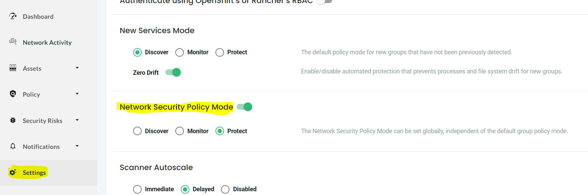
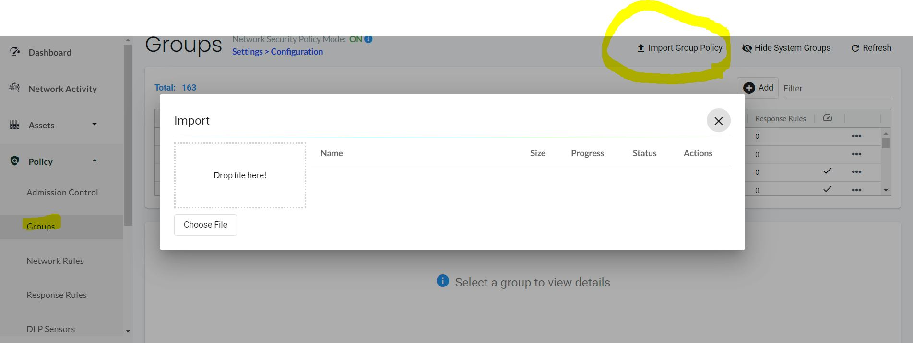

= Define Multitenant isolation for namespace

In this post we will examine using NeuVector Network rules to enable multi-tenancy isolation in openshift. Also how we can isolate external traffic from specific workload.

.References :
** https://docs.openshift.com/container-platform/4.12/networking/network_policy/multitenant-network-policy.html[Configuring multitenant isolation with network policy]
** https://open-docs.neuvector.com/[NeuVector Docs]

:sectnums:

== Multitenant isolation
In OCP 4 By default, all Pods and services in a project are accessible from other Pods in different namespaces. You can restrict this behavior either by using Networkploicies or use the multitenant isolation mode for the OpenShift SDN network.

In this post we use NeuVector to achieves same results.

===  Pod inter-communications
To explain how Pod inter-communications lets try a simple sample

[source,bash]
----
# ceate first sample application
oc new-project sample1
oc new-app httpd

# ceate Second sample application
oc new-project sample2
oc new-app httpd

# ceate Third sample application
oc new-project sample3
oc new-app httpd

----

Now lets try to play with curl to check communication accessibility

[source,bash]
----
# From sample1 call sample2
oc exec -n sample1 $(oc get po -n sample1 -l deployment=httpd -o name) -- curl --max-time 2 http://httpd.sample2.svc.cluster.local:8080
# From sample1 call sample3
oc exec -n sample1 $(oc get po -n sample1 -l deployment=httpd -o name) -- curl --max-time 2 http://httpd.sample3.svc.cluster.local:8080

# From sample2 call sample1
oc exec -n sample2 $(oc get po -n sample2 -l deployment=httpd -o name) -- curl --max-time 2 http://httpd.sample1.svc.cluster.local:8080
# From sample2 call sample3
oc exec -n sample2 $(oc get po -n sample2 -l deployment=httpd -o name) -- curl --max-time 2 http://httpd.sample3.svc.cluster.local:8080

# From sample3 call sample1
oc exec -n sample3 $(oc get po -n sample3 -l deployment=httpd -o name) -- curl --max-time 2 http://httpd.sample1.svc.cluster.local:8080
# From sample3 call sample2
oc exec -n sample3 $(oc get po -n sample3 -l deployment=httpd -o name) -- curl --max-time 2 http://httpd.sample2.svc.cluster.local:8080

----

Then we will expose the apache HTTP server so it can be externally accessibility

[source,bash]
----
oc expose svc/httpd  -n sample1
oc expose svc/httpd  -n sample2
oc expose svc/httpd  -n sample3

curl "http://$(oc get route -n sample1 -l  app.kubernetes.io/component=httpd  -o go-template='{{range .items}}{{.spec.host}}{{end}}')" 

curl "http://$(oc get route -n sample2 -l  app.kubernetes.io/component=httpd  -o go-template='{{range .items}}{{.spec.host}}{{end}}')" 

curl "http://$(oc get route -n sample3 -l  app.kubernetes.io/component=httpd  -o go-template='{{range .items}}{{.spec.host}}{{end}}')" 
----

We so our tests so NeuVector can discover our access behavior and how traffic flow to the workload.

== Configuring multitenant isolation using NeuVector Network rules

First thing is to ensure that NV Network Security Policy Mode is Protect so it blocks any communication unless there is an explicit Network rule to enable it. You can do this through settings page.

IMPORTANT: Once you enable Network Security Policy Mode as Protect, all cluster communication will be blocked unless explicitly enabled.  

The link:NvSecurityRule-multitenant-allow-external.yaml[NvSecurityRule-multitenant-allow-external] will create multitenant isolation on namespace sample1, so pods within sample1 only are allowed to communicate, and also incoming communication from both ingress, external and monitoring.

You can import the NvSecurityRule by using UI Policy>Group>Import Group Policy

for more information please refer to https://open-docs.neuvector.com/policy/usingcrd/import

Now lets try again previous curl to check communication accessibility

[source,bash]
----
# From sample2 call sample1 -- It should fail
oc exec -n sample2 $(oc get po -n sample2 -l deployment=httpd -o name) -- curl --max-time 2 http://httpd.sample1.svc.cluster.local:8080

# From sample3 call sample1 -- It should fail
oc exec -n sample3 $(oc get po -n sample3 -l deployment=httpd -o name) -- curl --max-time 2 http://httpd.sample1.svc.cluster.local:8080

# From sample1 call sample1 -- It should succeeded
oc exec -n sample1 $(oc get po -n sample1 -l deployment=httpd -o name) -- curl --max-time 2 http://httpd.sample1.svc.cluster.local:8080

# Now test from ingress as it should successes 
curl "http://$(oc get route -n sample1 -l  app.kubernetes.io/component=httpd  -o go-template='{{range .items}}{{.spec.host}}{{end}}')" 
----

== Disallow external communication using NeuVector Network rules

The link:NvSecurityRule-multitenant-disallow-external.yaml[NvSecurityRule-multitenant-disallow-external] will also disallow incoming communication from external through the exposed route.

You can import the NvSecurityRule by using UI Policy>Group>Import Group Policy

Now lets try again previous curl to check communication accessibility

[source,bash]
----
# Now test from ingress as it should successes 
curl "http://$(oc get route -n sample1 -l  app.kubernetes.io/component=httpd  -o go-template='{{range .items}}{{.spec.host}}{{end}}')" 
----